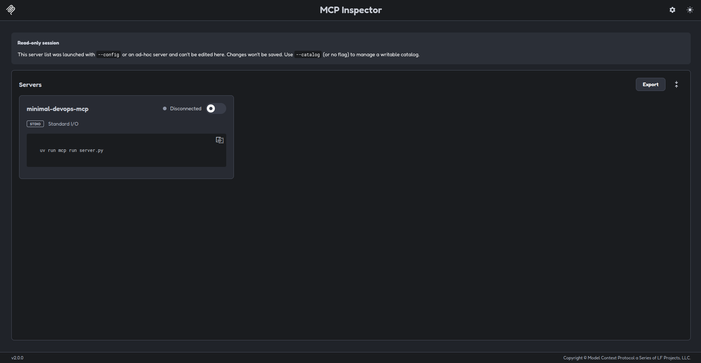

# 01 - Minimal Server [ES](README.md)

## Purpose

Create the samllest possible MCP server using the official Python SDK.

This example does not expose tools, resources, or prompts yet. Its purpose is to understand the server lifecycle, the `stdio` transport, and the connection with MCP Inspector.

## Requirements

- Python 3.10 or newer
- `uv`
- Node.js 22.19.0 or newer for MCP Inspector.

## Install dependencies

From this directory:

```bash
uv sync
```

---

## Run the server with MCP Inspector

```bash
uv run mcp dev server.py
```

Inspector starts the server as a local subprocess an connects to it through the `stdio` transport.

The server does not expose an HTTP port in this example.

## Run the server directly

```bash
uv run python server.py
```

The process waits for an MCP Client to communicate through `stdin` and `stdout`.

## What this example demonstrates

* Creating an `MCPServer`.
* Giving the server a name.
* Running the server with `stdio`.
* Protecting the entry point with `if __name__ == "__main__":`.
* Connecting the server to MCP Inspector.
* Testing the server in memory.

## Safety boundary

This example does not:

* Execute shell commands.
* Access Docker.
* Access Kubernetes.
* Access Terraform.
* Read files.
* Modify external systems.
* Use credentials or secrets.
* Expose an HTTP endpoint.

## Next example

The next exanmple adds the first MCP tool without connecting to external infraestructure.

#### [`pyproject.toml`](pyproject.toml)

<details>
  
  This file is the MCP configuration

</details>

#### [`server.py`](server.py)

<details>

  Python code used for server operation

</details>

#### [`test_server.py`](tests/test_server.py)

<details>

  Test file for the server

</details>

#### [`uv.lock`](uv.lock)

<details>

  Lock file, important that sets exact versions of dependencies and allows the environment correctly.

</details>

#### [`mcp-inspector.json`](mcp-inspector.json)

<details>

  .json file indicating the version used for the MCP-Inspector.

</details>

---

## Inspector configuration modes

MCP Inspector supports two configuration modes:

- `--config`: Loads a read-only configuration file. Changes made in the interface are not saved.

- `--catalog`: loads a writable catalog. Changes made in the interface can be persisted to the file.

For a reproducible project configuration:

```bash
npx @modelcontextprotocol/inspector@2.0.0 \
  --config mcp-inspector.json \
  --server minimal-devops-mcp
```

### Version pinning

The package tag sed for MCP inspector is important.

Avoid relying blindly on `latest`, because tags may point to different release lines over time. Older versions may lack support for the current MCP protocol or contain known bugs and security vulnerabilites

This example, use the tested Inspector version `2.0.0`.

When updating the version:

- Review the release notes.
- Check protocol compatibility.
- Review security advisories.
- Run the complete test suite.
- Update the documentation and lock files if needed.

For a locally editable Inspector catalog:

```bash
npx @modelcontextprotocol/inspector@2.0.0 \
  --config mcp-inspector.json \
  --server mcp-inspector.json
```

The Inspector configuration affects how the server is launched and inspected.
It does not modify the MCP server source code.

It is also a good idea to set the Python dependencies of the example coherently:

```toml
dependencies = [
    "mcp[cli]==2.0.0",
]
```

---

## Examples with images

Image showing the Inspector MCP minimal.



Image showing the activate server.


