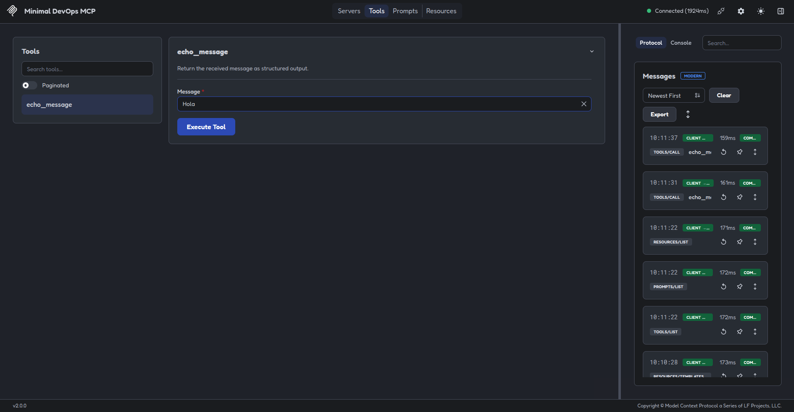
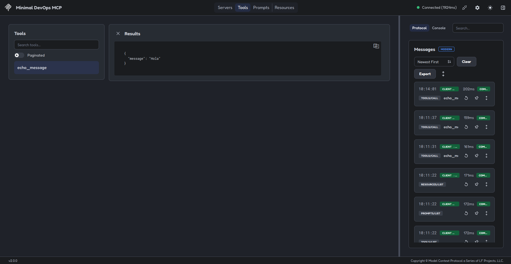

# 02 - First Tool [EN](README.en.md)

## Propósito

En este ejemplo se muestra el uso de una herramienta MCP. Antes de empezar a usar recursos reales para entornos DevOps, se mantiene la misma arquitectura que en el ejemplo anterior, donde se explica el uso de estos archivos y el funcionamiento de cada uno.

Aquí se muestran los comandos necesarios para registrar y probar una herramienta.

## Comandos

Desde este repositorio `examples/02-first-tool/`:

```bash
uv sync
```

Tests:

```bash
uv run pytest
```

Inspector con tag y versión 2.0.0:

```bash
npx -y @modelcontextprotocol/inspector@2.0.0 \
  --config mcp-inspector.json \
  --server first-tool-devops-mcp
```

## Imágenes

Imagen que muestra la herramienta dentro del Inspector:




Imagen que muestra el registro de la herramienta:

