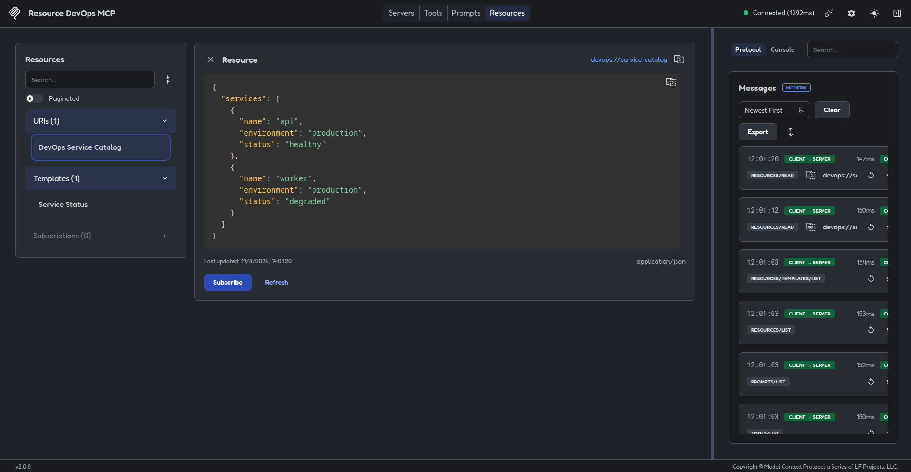
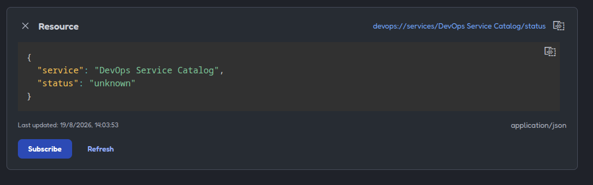

# 03 - Resources [EN](README.en.md)

## Proposito

Este ejemplo muestra cómo registrar y leer recursos MCP.

Un recurso representa informacion que el servidor expone para que el cliente pueda consultarla. A diferencia de una tool, su objetivo principal es proporcionar contexto o datos, no ejecutar una accion.

## Recursos incluidos

### Recurso estatico

URI:

```text
devops://service-catalog
```

Devuelve un catálogo fijo de servicios DevOps en formato JSON.

## Recurso dinámico

Plantilla:

```text
devops://services/{service_name}/status
```

Permite consultar el estado de un servicio concreto sustituyendo {service_name} por su nombre.

Ejemplo:

```text
devops://services/worker/status
```

## Comandos

Desde este directorio:

```bash
uv sync
```

Ejecutar los tests:

```bash
uv run pytest
```

Abrir MCP Inspector:

```bash
npx -y @modelcontextprotocol/inspector@2.0.0 \
  --config mcp-inspector.json \
  --server resources-devops-mcp
```

## Que observar en Inspector

En la sección `Resources` aparecerá el recurso estatico.

En `Resource Templates` aparecerá la plantilla dinámica. Desde ahi se puede seleccionar un servicio y leer el contenido resultante.

## Limites del ejemplo

Este ejemplo no consulta todavia APIs externas, Kubernetes, cloud ni archivos del sistema. Los datos estan definidos dentro del servidor para centrarnos en la estructura y el comportamiento de los recursos MCP.

---

## Imagenes de muestra

Captura que muestra el recurso desplegado:



Captura que muestra el recurso desplegado en la interfaz grafica:


