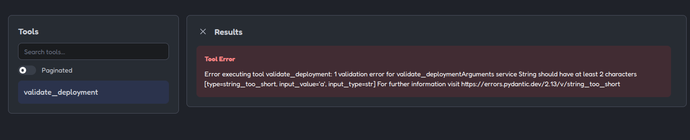
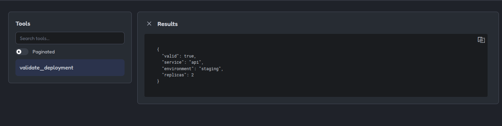

# 04 - Validation [ES](README.md)

## Purpose

This example demonstrates input validation in MCP servers, which is essential
for securing different tools and resources.

Validation is especially important in DevOps environments because an invalid
input could trigger an unexpected operation on real infrastructure.

The tool in this example does not perform deployments or modify external
resources. It only checks whether a deployment request complies with the
defined rules.

## What is validated

The `validate_deployment` tool receives the following fields:

| Field | Type | Rules |
|---|---|---|
| `service` | `string` | Between 2 and 50 characters |
| `environment` | `string` | `development`, `staging`, or `production` |
| `replicas` | `integer` | Between 1 and 10 |

## Valid example

```json
{
    "service": "api",
    "environment": "staging",
    "replicas": 2
}
```

Expected response:

```json
{
    "valid": true,
    "service": "api",
    "environment": "staging",
    "replicas": 2
}
```

## Examples of rejected inputs

### Replica count outside the allowed range

```json
{
    "service": "api",
    "environment": "staging",
    "replicas": 0
}
```

> The minimum allowed value is `1`.

### Unsupported environment

```json
{
    "service": "api",
    "environment": "production-old",
    "replicas": 2
}
```

> Only environments explicitly defined by the schema are allowed.

### Service name that is too short

```json
{
    "service": "a",
    "environment": "development",
    "replicas": 1
}
```

> The service name must contain at least two characters.

## Validation versus execution

This example separates two responsibilities:

1. Validating that the request has an accepted structure and allowed values.
2. Executing an operation on an external system.

A valid request does not mean that it should be executed automatically. In a
real DevOps server, the following checks would still be required:

* The user's identity.
* Their permissions on the resource.
* The selected environment.
* The active context or account.
* The applicable security policies.
* The existence of the service.
* The result of a plan or dry run.
* Explicit confirmation before modifying resources.

## Best practices

### Use allowlists

When a field only accepts certain values, it is preferable to define an
explicit list or an enumerated type:

```python
Literal["development", "staging", "production"]
```

### Define numeric limits

Numeric values should have reasonable limits:

```python
Field(ge=1, le=10)
```

This prevents negative values, zero, or disproportionate quantities from
being accepted.

### Validate before use

The input must be validated before:

* Building commands.
* Calling external APIs.
* Creating manifests.
* Accessing cloud resources.
* Running Terraform, Ansible, or `kubectl`.
* Changing infrastructure state.

### Reject by default

If an input does not match the schema, it must be rejected. The server should
not invent values, silently correct the request, or assume the environment.

### Do not rely solely on the client

Even if the client displays a form generated from the schema, validation must
also exist on the server. A client may be misconfigured or send a manual
request.

### Keep validation separate from authorization

Validation answers this question:

> Does the request have a correct structure and valid values?

Authorization answers a different question:

> Is this identity allowed to perform this operation on this resource?

Both checks are required and must not be confused.

---

## Run the example

From this directory:

```bash
uv sync
```

Run the tests:

```bash
uv run pytest
```

## Test it with MCP Inspector

```bash
npx -y @modelcontextprotocol/inspector@2.0.0 \
  --config mcp-inspector.json \
  --server validation-devops-mcp
```

The `Tools` section will show `validate_deployment`.

You can test both valid inputs and inputs that violate the schema constraints.

---

## What the tests demonstrate

The tests cover:

* A valid request.
* A replica count outside the allowed range.
* An unsupported environment.
* A service name that is too short.

Valid inputs return a structured response. Invalid inputs produce a response
marked as an error and do not continue to any external operation.

## Example limitations

This example does not:

* Deploy applications.
* Modify cloud resources.
* Execute system commands.
* Query Kubernetes.
* Run Terraform or Ansible.
* Access credentials.
* Perform irreversible changes.

Its purpose is to demonstrate how to build a validation boundary before
connecting an MCP tool to real DevOps systems.

---

## Example Images

#### Capture showing information the server ***Validation***:




#### Capture showing validation using an allowed environment:

```json
{
    "service": "api",
    "environment": "staging",
    "replicas": 2
}
```




#### Capture showing api error using an unauthorized, short or invalid entry or environment:

```json
{
    "service": "api",
    "environment": "development",
    "replicas": 1
}
```

