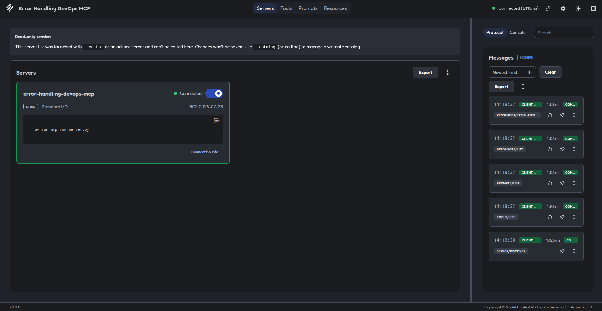
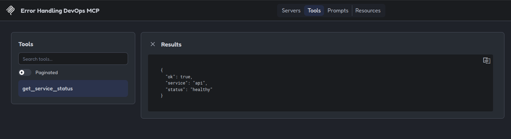
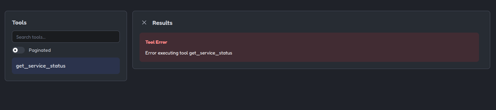

# 05 - Error Handling [EN](README.en.md)

## Propósito

Este ejemplo muestra cómo gestionar distintos tipos de errores en una tool MCP sin romper el servidor ni exponer información sensible.

La tool `get_service_status` simula la consulta del estado de un servicio DevOps y permite observar diferentes respuestas según el problema encontrado.


## Tipos de errores incluidos

Este ejemplo diferencia entre:

1. Una respuesta válida.
2. Un error esperado del dominio.
3. Una entrada vacía.
4. Una excepción inesperada.

---


## Respuesta válida

Entrada:
```json
{
    "service": "api"
}
```

Respuesta:
```json
{
    "ok": true,
    "service": "api",
    "status": "healthy"
}
```

En este caso, la llamada se completa correctamente y `is_error` es `false`.

## Error esperado del dominio

Si se consulta un servicio inexistente:

```json
{
    "service": "missing-service"
}
```

La tool devuelve una respuesta estructurada:

```json
{
    "ok": false,
    "error": "service_not_found",
    "message": "The requested service does not exist."
}
```

Este tipo de error forma parte del comportamiento esperado de la aplicación.

Por eso se devuelve como una respuesta normal con `ok: false`, no como una excepción interna.

## Entrada vacía

Si no se proporciona un nombre de servicio:

```json
{
    "service": ""
}
```

La respuesta es:

```json
{
    "ok": false,
    "error": "service_required",
    "message": "A service name is required."
}
```

## Error inesperado

El valor `backend-timeout` simula un problema de un sistema externo:

```json
{
    "service": "backend-timeout"
}
```

En este caso se lanza una excepción:

```python
raise TimeoutError(
    "The status provider did not respond within the time limit."
)
```

MCP marca la respuesta como error mediante:

```python
result.is_error is True
```

Este comportamiento representa un fallo que la tool no puede resolver como respuesta normal.


---


## Diferencia entre errores esperados e inesperados

| Tipo | Ejemplo | Respuesta |
|---|---|---|
| Resultado válido | `api` | `ok: true` |
| Error de dominio | `missing-service` | `ok:false` |
| Entrada vacía | `""` | `ok: false` |
| Fallo inesperado | `backend-timeout` | `is_error: true` |

Los errores esperados deben devolver códigos y mensajes estables. Las excepciones inesperadas deben quedar marcadas como errores de la tool.


---

## Buenas prácticas

### Usar códigos de error estables

Es preferible utilizar códigos que el cliente pueda interpretar:

```json
{
    "error": "service_not_found"
}
```

El cliente puede usar `service_not_found` para decidir qué acción realizar, aunque el texto del mensaje cambie posteriormente.

### No exponer trazas internas

No se deben devolver al cliente:

* Trazas completas de Python.
* Rutas internas del servidor.
* Nombres de hosts privados.
* Tokens o credenciales.
* Variables de entorno.
* Detalles de autenticación.
* Información sensible de otro recurso.

El cliente debe recibir un mensaje útil, pero limitado.

### Separar mensajes públicos y detalles internos

El mensaje público puede ser:

```text
the status provider did not respond within the time limit.
```

Los detalles técnicos, el endpoint, la excepción original o el número de reintentos deberían registrarse internamente.

### No ocultar errores inesperados

No se deben convertir todos los errores en:

```json
{
    "ok": true
}
```

Un fallo real debe mantenerse visible para que el cliente, los tests y la monitorización puedan detectarlo.

### Mantener respuestas previsibles

Las tools deben utilizar una estructura coherente para que los clientes puedan procesar sus respuestas sin depender de textos ambiguos.

### No reintentar sin control

Los reintentos frente a un sistema externo deben tener:

* Un número máximo.
* Un tiempo límite.
* Una estrategia definida.
* Un comportamiento claro cuando se agotan.

### No realizar cambios como respuesta automática a un error

Un error de consulta no debe provocar automáticamente:

* Reinicios.
* Rollbacks.
* Cambios de configuración.
* Escalados.
* Eliminación de recursos.
* Nuevos despliegues.

Cualquier acción con impacto debe estar separada y protegida por sus propias validaciones y confirmaciones.

---

## Ejecutar el ejemplo

Desde este directorio:
```bash
uv sync
```

Ejecutar los tests:
```bash
uv run pytest
```

## Probarlo con MCP Inspector

```bash
npx -y @modelcontextprotocol/inspector@2.0.0 \
  --config mcp-inspector.json \
  --server error-handling-devops-mcp
```

En la sección `Tools` aparecerá:

```text
get_service_status
```

Prueba los siguientes valores:
```text
api
missing-service
backend-timeout
```

También puedes probar una cadena vacía para observar el error `service_required`.

## Qué demuestran los tests

Los tests comprueban:

* Una respuesta válida.
* Un servicio inexistente.
* Una entrada vacía.
* Un timeout del sistema externo.
* La diferencia entre `ok: false` e `is_error: true`.

## Límites del ejemplo

Este ejemplo no:

* Consulta una API real.
* Accede a Kubernetes.
* Ejecuta comandos del sistema.
* Realiza despliegues.
* Modifica recursos cloud.
* Reinicia servicios.
* Utiliza credenciales reales.
* Implementa logging externo.

El timeout y los servicios especiales son simulaciones locales para estudiar el comportamiento del servidor ante distintos errores.


---


## Imágenes


#### Captura mostrando el servidor encendido:




#### Captura mostrando el servicio `api`:




#### Captura mostrando error backend:


