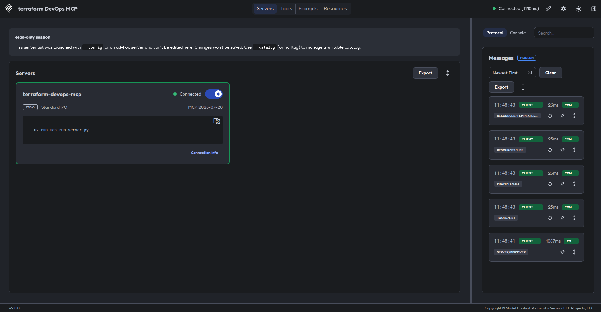
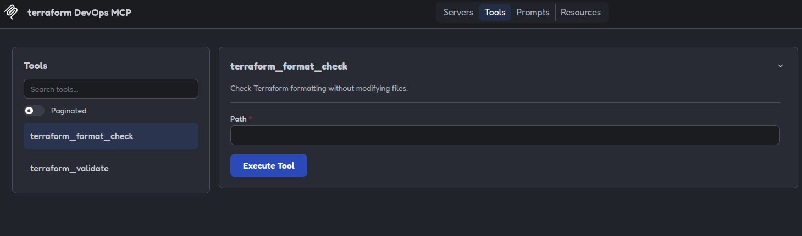
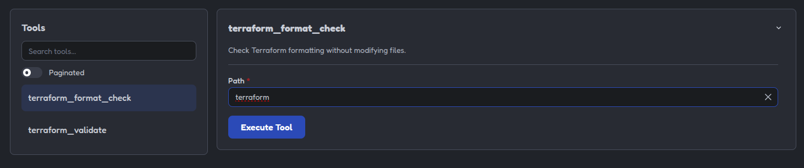
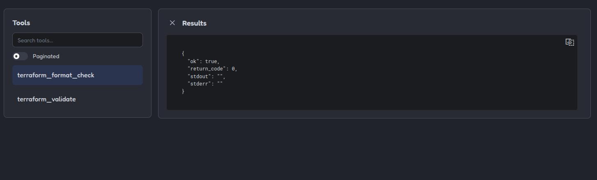
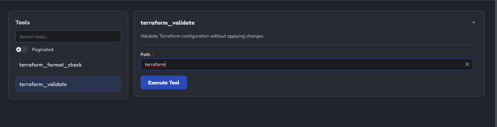
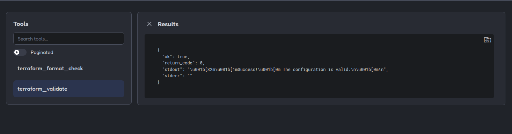

# 06 - Terraform [ES](README.md)

## Purpose

This example shows how to use an MCP server to run safe checks on a Terraform
configuration.

The server exposes read-only tools that can check formatting or validate the
configuration without applying changes to the infrastructure.

## Included tools

### `terraform_format_check`

Checks whether Terraform files follow the expected format:

```bash
terraform fmt -check -diff -recursive
```

This variant uses `-check`, so it does not modify the files.

If formatting differences are found, the result includes the diff details.

### `terraform_validate`

Checks whether the Terraform configuration is valid:

```bash
terraform validate
```

This operation checks the syntax and internal configuration of the Terraform
files, but it does not create or modify resources.

## Terraform configuration

The `terraform/` directory contains a minimal local configuration:

```hcl
terraform {
    required_version = ">= 1.6.0"
}

variable "service_name" {
    type        = string
    description = "Name of the service."
    default     = "api"
}

output "service_name" {
    value = var.service_name
}
```

This configuration does not use cloud providers or external resources. Its
purpose is to provide a safe foundation for testing the validations.

---

## Path validation

Before Terraform is executed, the server checks that:

* The path exists.
* It is a directory.
* It contains at least one `.tf` file.
* Execution takes place within the validated path.

An invalid path produces a controlled error and does not execute any command.

---

## Command security

The server executes commands using an argument list:

```python
[
    "terraform",
    "fmt",
    "-check",
    "-diff",
    "-recursive",
]
```

It does not use `shell=True` or build commands by concatenating text received
from the user.

In addition:

* A maximum execution time is set.
* Arbitrary commands cannot be executed.
* `terraform apply` is not executed.
* `terraform destroy` is not executed.
* `terraform taint` is not executed.
* Terraform files are not modified.
* Workspaces are not changed.
* Cloud providers are not accessed.
* Real credentials are not used.

## Initializing the local configuration

To validate a Terraform configuration, it may be necessary to initialize the
directory without using a remote backend:

```bash
terraform init -backend=false
```

This operation prepares the local directory for validation. It does not connect
to a remote backend or apply changes to infrastructure.

## Run the example

From this directory:

```bash
uv sync
```

Run the tests:

```bash
uv run pytest
```

### Test it with MCP Inspector

```bash
npx -y @modelcontextprotocol/inspector@2.0.0 \
  --config mcp-inspector.json \
  --server terraform-devops-mcp
```

The `Tools` section will show:

```text
terraform_format_check
terraform_validate
```

The following path can be used for testing:

```text
terraform
```

---

## Example of a valid response

```json
{
    "ok": true,
    "return_code": 0,
    "stdout": "Success! The configuration is valid.\n",
    "stderr": ""
}
```

The exact `stdout` content may vary depending on the installed Terraform
version.

## Example of a response with errors

If the configuration is invalid, the response may include:

```json
{
    "ok": false,
    "return_code": 1,
    "stdout": "",
    "stderr": "Terraform configuration is invalid."
}
```

The tool returns the result of the check but does not attempt to automatically
correct the files.

## What the tests demonstrate

The tests demonstrate:

* That a valid Terraform path can be accepted.
* That a missing path produces an error.
* That a path without `.tf` files is rejected.
* That the checks run on a validated path.

Terraform execution tests can use mocks so they do not depend on Terraform
being installed in the test environment.

## Difference between validation and apply

Validation only checks the configuration:

```bash
terraform validate
```

Applying changes modifies the infrastructure:

```bash
terraform apply
```

This example only uses inspection and validation operations. A valid
configuration does not mean that it is authorized to be applied or that it
should be deployed automatically.

Before executing any impactful operation, the following should be checked:

* The active account.
* The project or subscription.
* The workspace.
* The backend.
* The environment.
* The permissions.
* The generated plan.
* Explicit approval for the operation.

## Example limitations

This server does not:

* Execute `terraform apply`.
* Execute `terraform destroy`.
* Make infrastructure changes.
* Access Kubernetes.
* Access GCP or Azure.
* Use cloud credentials.
* Modify Terraform files.
* Execute arbitrary commands.
* Change the remote backend.
* Change workspaces automatically.

The purpose is to demonstrate how to integrate read-only Terraform checks into
an MCP tool with path validation and security limits.

---

## Example images

#### Image showing the MCP server running:



#### Image showing the created tools:



#### Image showing the `terraform_format_check` tool:



#### Image showing the expected result after entering the ***terraform*** path in `terraform_format_check`:



#### Image showing the `terraform_validate` tool:



#### Image showing the result after entering the ***terraform*** path in `terraform_validate`:


