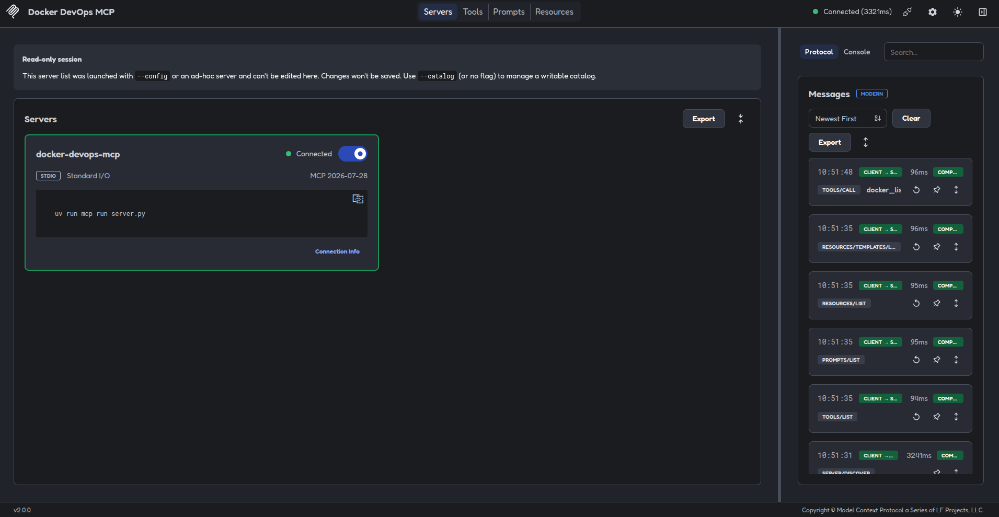
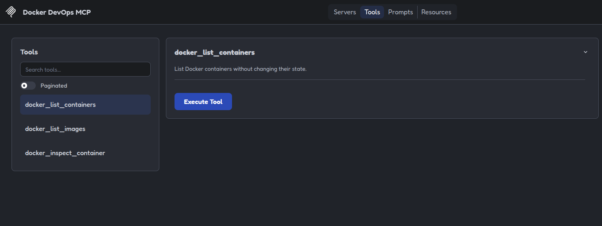
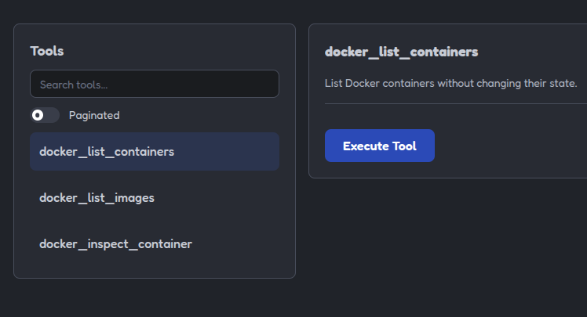
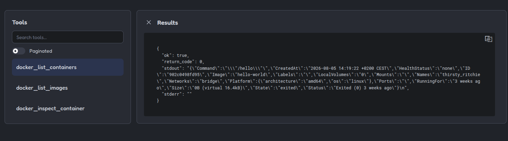
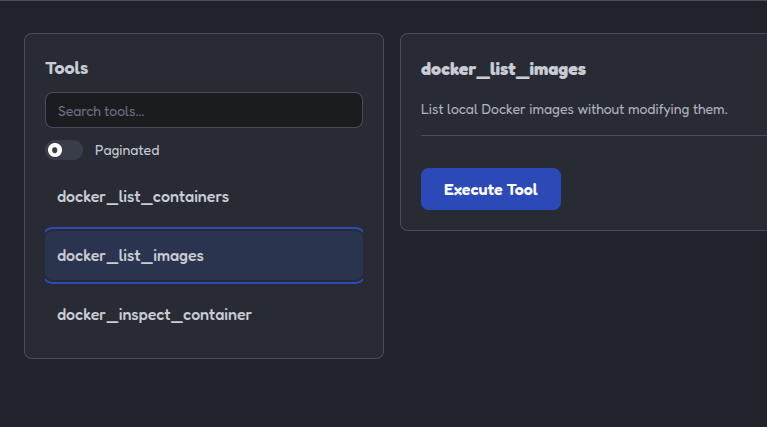
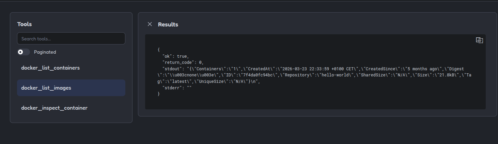
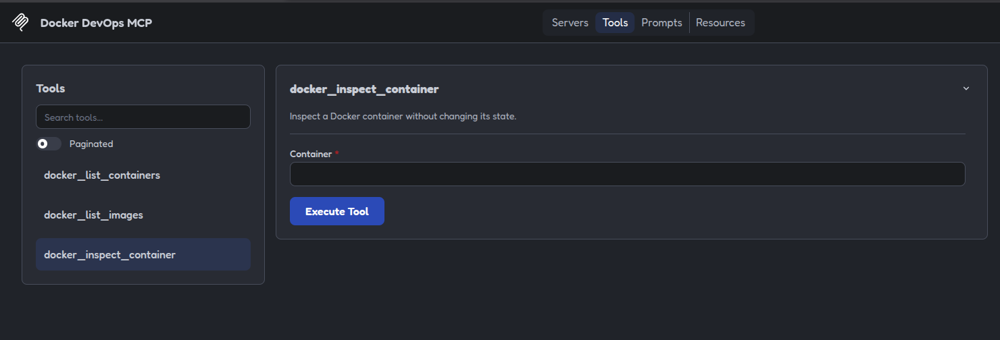
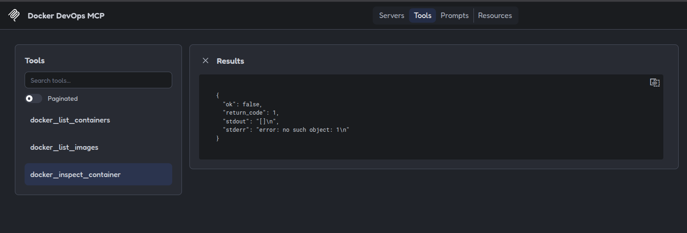

# 07 - Docker [ES](README.md)

## Purpose

This example shows how to use an MCP server to query Docker information through
read-only tools.

## Included tools

### `docker_list_containers`

Runs:

```bash
docker ps --all
```

Allows active and stopped containers to be queried.

### `docker_list_images`

Runs:

```bash
docker image ls
```

Allows locally available images to be queried.

### `docker_inspect_container`

Runs:

```bash
docker inspect <container>
```

It receives the container name or ID and returns detailed information without
modifying it.

## Excluded operations

This example does not execute:

```text
docker run
docker stop
docker start
docker restart
docker rm
docker rmi
docker exec
docker build
docker push
docker system prune
```

These operations can create, modify, stop, execute, or delete resources.

---

## Security

Commands are executed using argument lists and do not use `shell=True`.

The server:

* Does not execute arbitrary commands.
* Does not modify containers.
* Does not delete images.
* Does not start or stop services.
* Does not access Docker through remote sockets.
* Sets a maximum execution time.
* Rejects empty container names.

## Run the example

```bash
uv sync
uv run pytest
```

## Test it with MCP Inspector

```bash
npx -y @modelcontextprotocol/inspector@2.0.0 \
  --config mcp-inspector.json \
  --server docker-devops-mcp
```

The `Tools` section will show:

```text
docker_list_containers
docker_list_images
docker_inspect_container
```

## Note about the tests

The tests use mocks so they do not depend on Docker during execution.

To use the tools against a real environment, Docker must be installed and the
user must have permission to query the local daemon.

## Example limitations

This server only queries local Docker information. It does not manage
containers or images and does not make changes to the environment.

## Images

Image showing the server running:



Image showing the server's `Tools`:



Image showing the `list-containers` tool:



Image showing the result of the previous tool:



Image showing the `list-images` tool:



Image showing the result of the previous tool:



Image showing the `docker_inspect_container` tool:



Image showing an error when no container is found. This error is included for
demonstration purposes:


