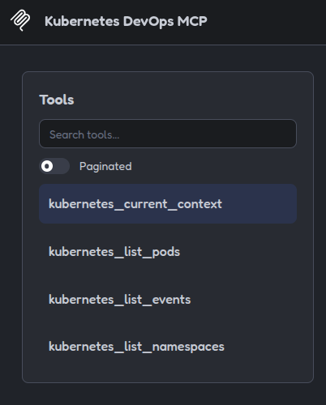
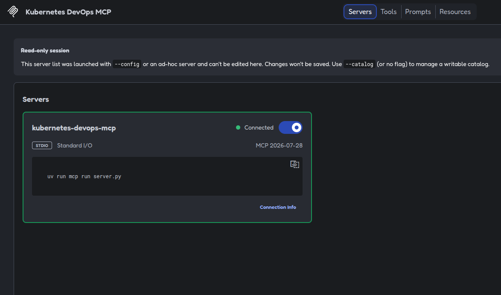
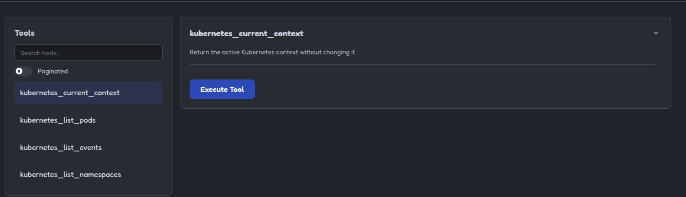
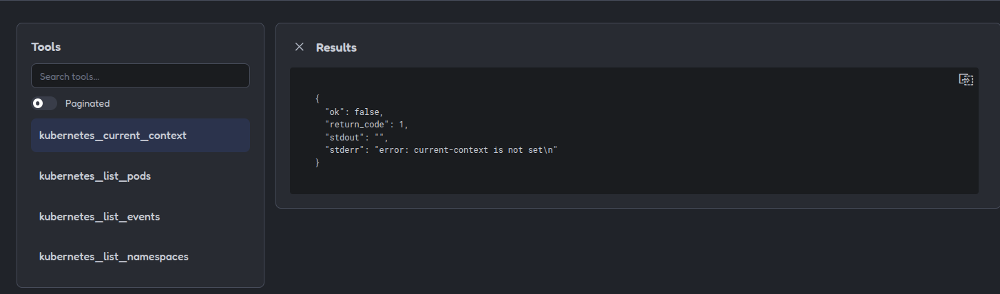
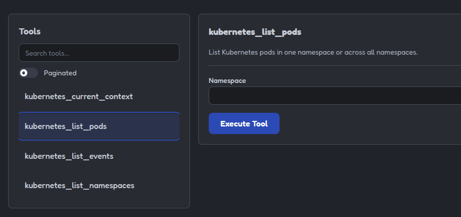
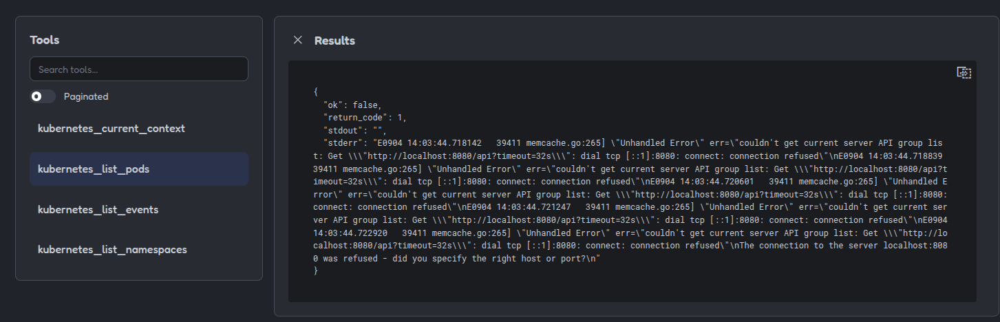
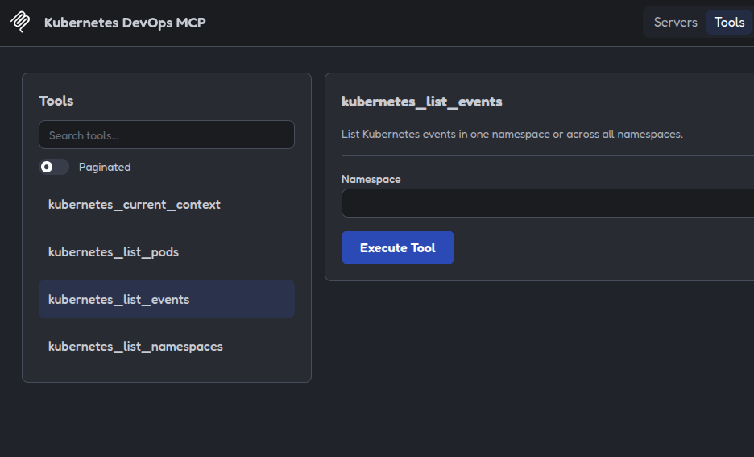
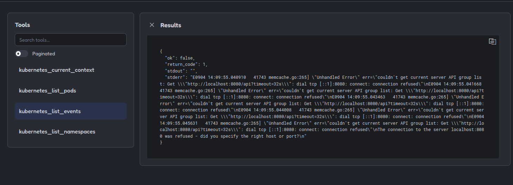
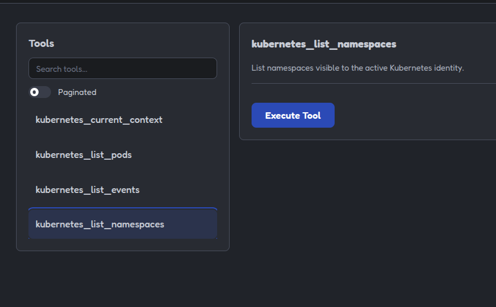
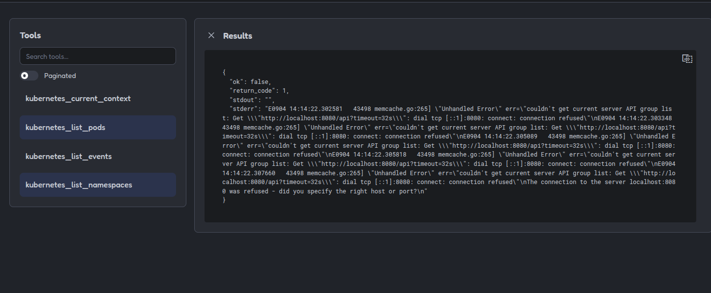

# 08 - Kubernetes [ES](README.md)

## Purpose

This example shows how to use an MCP server to query information from a
Kubernetes cluster through read-only tools.

The server uses the active `kubectl` context and does not change the context or
modify resources.

## Included tools

### `kubernetes_current_context`

Runs:

```bash
kubectl config current-context
```

Shows the active context without changing it.

### `kubernetes_list_pods`

With a specific namespace:

```bash
kubectl get pods \
  --namespace default \
  --output wide
```

Without specifying a namespace:

```bash
kubectl get pods \
  --all-namespaces \
  --output wide
```

### `kubernetes_list_events`

Queries events from a namespace:

```bash
kubectl get events \
  --namespace default \
  --sort-by=.lastTimestamp
```

Events help detect scheduling, image, probe, volume, and restart problems.

### `kubernetes_list_namespaces`

Runs:

```bash
kubectl get namespace
```

Shows the namespaces visible to the active identity.

---

## Namespace validation

When a namespace is provided, the server checks that:

* It is not empty.
* It does not start with `-`.
* It is used as a separate argument.
* It is not concatenated inside a shell.

An invalid namespace produces a controlled error and does not execute
`kubectl`.

## Active context

The server queries the context currently configured in `kubectl`.

It does not automatically perform either of these actions:

```bash
kubectl config use-context
kubectl config set-context
```

Before querying a real cluster, the following should be checked manually:

```bash
kubectl config current-context
kubectl auth can-i get pods
```

## Excluded operations

This example does not execute:

```text
kubectl apply
kubectl delete
kubectl patch
kubectl edit
kubectl replace
kubectl scale
kubectl rollout restart
kubectl rollout undo
kubectl exec
kubectl cp
kubectl create
kubectl config use-context
```

These operations can modify resources, execute commands inside containers,
change the context, or alter the cluster state.

## Security

Commands are executed using argument lists and do not use `shell=True`.

The server:

* Does not execute arbitrary commands.
* Does not change the context.
* Does not modify resources.
* Does not delete resources.
* Does not execute commands inside containers.
* Sets a maximum execution time.
* Validates the namespace before using it.
* Uses the user's active context.
* Returns the output and return code from `kubectl`.

Information returned by Kubernetes may contain service names, internal
addresses, events, and sensitive operational data.

## Run the example

From this directory:

```bash
uv sync
```

Run the tests:

```bash
uv run pytest
```

---

## Environment requirements

To use the tools against a real cluster, the following are required:

* `kubectl` installed.
* A configured Kubernetes context.
* Access to a cluster.
* Read permissions for the queried resources.

The tests do not need a real cluster because they use mocks.

## Test it with MCP Inspector

```bash
npx -y @modelcontextprotocol/inspector@2.0.0 \
  --config mcp-inspector.json \
  --server kubernetes-devops-mcp
```

The `Tools` section will show:

```text
kubernetes_current_context
kubernetes_list_pods
kubernetes_list_events
kubernetes_list_namespaces
```

---

## Usage examples

Query the current context:

```json
{}
```

Query pods in a namespace:

```json
{
    "namespace": "default"
}
```

Query pods across all namespaces:

```json
{}
```

Query events in a namespace:

```json
{
    "namespace": "default"
}
```

Query all namespaces:

```json
{}
```

## Error responses

If the namespace is empty:

```json
{
    "namespace": " "
}
```

The tool returns a controlled error and does not execute any command.

If `kubectl` cannot access the cluster, the response will include:

```json
{
    "ok": false,
    "return_code": 1,
    "stdout": "",
    "stderr": "..."
}
```

The exact error content depends on the active context and the local Kubernetes
configuration.

## What the tests demonstrate

The tests verify:

* The active context query.
* Pod queries in a namespace.
* Pod queries across all namespaces.
* Event queries.
* Namespace queries.
* Rejection of empty namespaces.
* Command construction without using a shell.

## Example limitations

This server does not:

* Perform deployments.
* Delete resources.
* Modify manifests.
* Restart workloads.
* Scale deployments.
* Execute commands inside containers.
* Change the active context.
* Change namespaces automatically.
* Access credentials directly.
* Perform operations on clusters without authorization.

The purpose is to demonstrate read-only Kubernetes inspection through a
controlled and predictable MCP server.

The central idea of the example is:

```text
active context
       |
       v
optional namespace
       |
       v
read-only kubectl query
       |
       v
structured result
```

> Because no Kubernetes context is configured, all four tools will return an
> error when executed. This does not mean that the tools are broken; it is the
> expected behavior.

---

## Example images

#### Capture showing the active MCP server state:



#### Capture showing the `Tools` list:



### `Tools` captures

#### Capture showing the `current_context` tool:



#### Capture showing the `current_context` tool error:



#### Capture showing the `list_pods` tool:



#### Capture showing the `list_pods` tool error:



#### Capture showing the `list_events` tool:



#### Capture showing the `list_events` tool error:



#### Capture showing the `list_namespaces` tool:



#### Capture showing the `list_namespaces` tool error:


