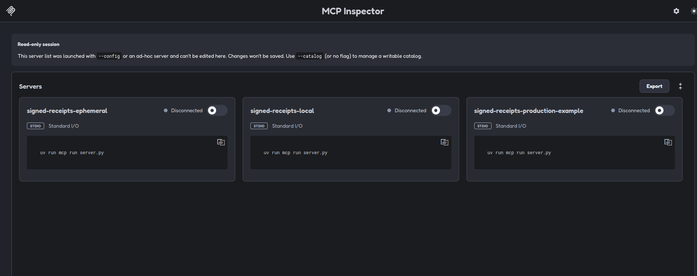
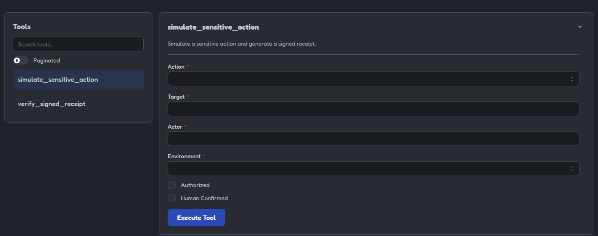
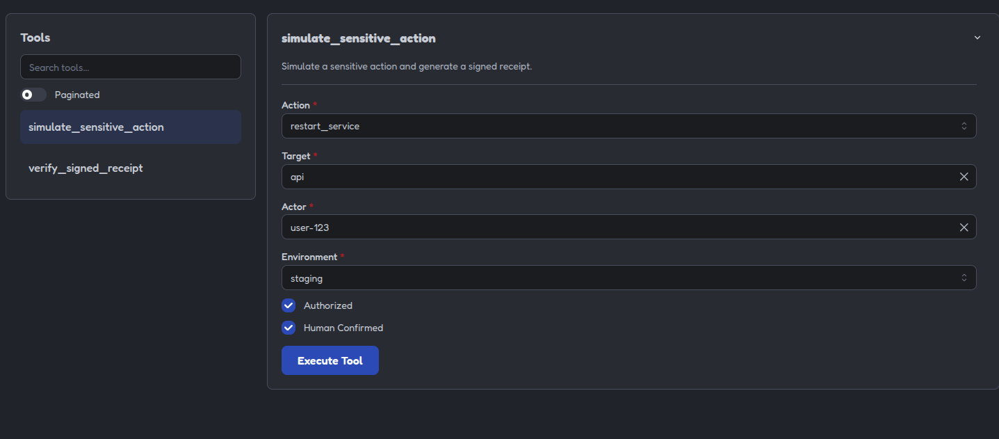
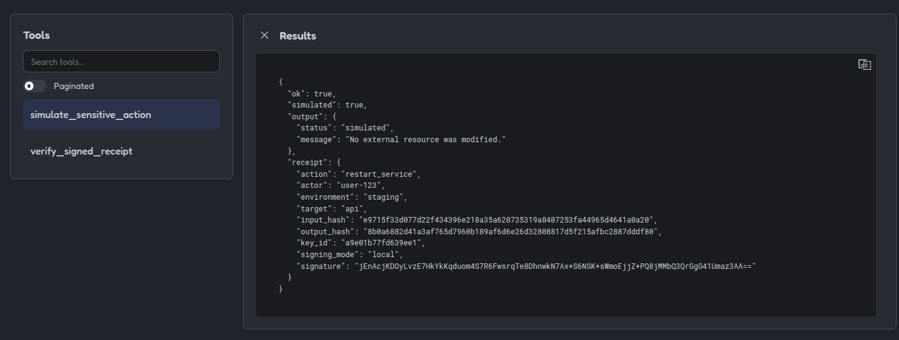
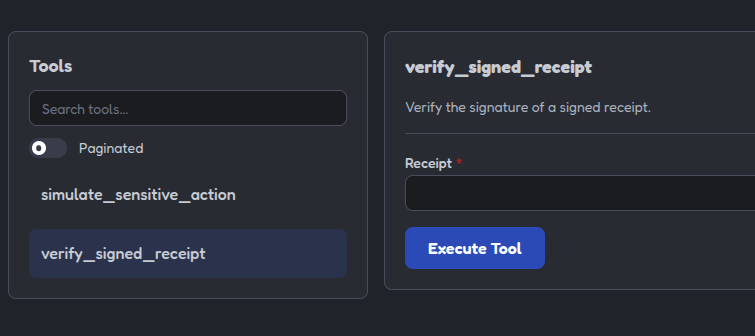
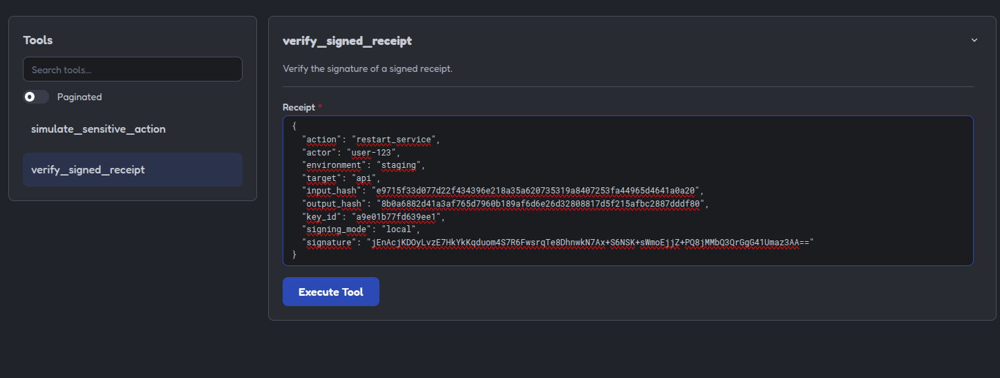
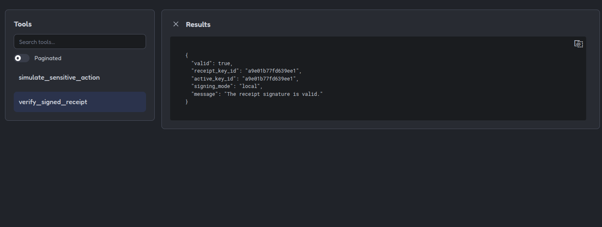

# 09 - Signed Receipts [EN](README.en.md)


## Propósito

Este ejemplo muestra cómo generar y verificar recibos firmados para acciones sensibles ejecutadas por un servidor MCP.


Un recibo firmado es una evidencia portable que permite comprobar posteriormente que una afirmación concreta fue firmada por una clave determinada y que sus datos no fueron modificados después.

Este ejemplo utiliza una acción simulada. No modifica Kubernetes, Docker, Terraform, archivos locales ni ningún sistema externo.

> Podemos aplicar estos recibos firmados junto con las herramientas mencionadas anteriormente, agregando así una capa más de validación y seguridad.


## Qué problema resuelve

Los logs internos son útiles para depurar y auditar operaciones dentro de una organización. Sin embargo, en algunos flujos puede ser necesario transportar una evidencia a otro sistema o equipo.


Por ejemplo:

- Un agente solicita una operación sensible.
- Un servidor MCP valida la solicitud.
- La operación requiere autorización y confirmación humana.
- El servidor registra el resultado.
- Se genera un recibo firmado.
- Otro sistema verifica posteriormente el recibo.


El recibo permite comprobar que su contenido no fue alterado después de ser firmado.


## Qué no demuestra una firma

Una firma válida no demuestra por sí sola:

- Que la operación fuera correcta.
- Que la identidad estuviera autorizada.
- Que la confirmación humana fuera auténtica.
- Que el servidor no estuviera comprometido.
- Que el entorno de ejecución fuera confiable.
- Que el resultado de negocio fuera correcto.
- Que la operación cumpliera todas las políticas.


La firma demuestra principalmente:


- Qué datos fueron firmados.
- Que esos datos no fueron modificados.
- Qué clave produjo la firma.

Por eso un recibo firmado no sustituye la validación, la autorización, la confirmación humana, los logs ni las auditorías del proveedor.

## Flujo del ejemplo


```text
acción sensible solicitada
          |
          v
validación de la entrada
          |
          v
Comprobación de autorización
          |
          v
confirmación humana
          |
          v
acción simulada
          |
          v
registro de entrada y salida
          |
          v
hash de los datos
          |
          v
recibo firmado
          |
          v
verificación posterior
```

## Modos de gestión de claves

Este ejemplo permite seleccionar cómo se obtiene la clave privada utilizada para firmar los recibos.

### Ephemeral

Genera una nueva clave en memoria cada vez que arranca el servidor.


```bash
MCP_SIGNING_MODE=ephemeral
```

Es útil para pruebas rápidas, pero los recibos dejan de poder verificarse si el servidor se reinicia, porque la clave anterior desaparece.

### Local

Carga o crea una clave persistente en un archivo local:

```bash
MCP_SIGNING_MODE=local
MCP_SIGNING_KEY_PATH=keys/dev-signing-key.pem
```

Este es el recomendado para probar el ejemplo con MCP Inspector, ya que permite verificar recibos aunque el servidor se reinicie.

La clave local debe permanecer fuera del control de versiones y tener permisos restrictivos, como `600`.

## Production example

Representa una integración con un proveedor externo de claves:

```bash
MCP_SIGNING_MODE=production
```

En un entorno real, la clave deberia proceder de un KMS, HSM o gestor de secretos. Este ejemplo utiliza una variable de entorno únicamente como adaptador didáctico:

```bash
MCP_SIGNING_PRIVATE_KEY_B64=<external-key-required>
```

Nunca se deben incluir claves privadas reales en el repositorio, en el archivo de configuración de Inspector ni en los recibos.

## Perfiles de MCP Inspector

El archivo `mcp-inspector.json` incluye tres perfiles:

| Perfil | Gestión de clave | Uso |
|---|---|---|
| `signed-receipts-ephemeral` | Memoria | Pruebas rápidas |
| `signed-receipts-local` | Archivo local | Desarrollo e Inspector |
| `signed-receipts-production-example` | Proveedor externo | Demostración conceptual |

Cada entrada inicia un proceso independiente. Un recibo generado por un perfil no debe verificarse usando otro perfil, porque cada uno puede utilizar una clave distinta.

Para probar el flujo completo, utiliza siempre el mismo perfil:

1. Ejecuta `simulate_sensitive_action`.
2. Copia el recibo generado.
3. Ejecuta `verify_signed_receipt`.
4. Pega el contenido del recibo.

## Identificación de la clave

Cada recibo incluye un `key_id`. Este valor es una huella derivada de la clave pública utilizada para firmarlo.

```json
{
    "key_id": "a9e01b77fd639ee1"
}
```

El `key_id` no es una clave privada ni permite firmar recibos. Sirve para identificar qué clave se utilizó y facilitar futuras rotaciones de claves.

### Advertencia importante sobre Inspector

### Formato de entrada en `verify_signed_receipt`.

En MCP Inspector, el campo de entrada de la `tool` ya corresponde al argumento `receipt`.

Por tanto, hay que pegar únicamente el contenido interno del recibo:

```json
{
    "action": "restart_service",
    "actor": "user-123",
    "environment": "staging",
    "target": "api",
    "input_hash": "...",
    "output_hash": "...",
    "key_id": "...",
    "signature": "..."
}
```

No hay que añadir otra envoltura:

```json
{
    "receipt": {
        "action": "restart_service"
    }
}
```

Si se añade esa propiedad manualmente, el objeto queda anidado dos veces y la verificación falla aunque la firma original sea correcta.


---


## Tools incluidas

#### `simulate_sensitive_action`

Simula una acción sensible como:

```text
restart_service
deploy_service
```

La tool recibe:

| Campo | Descripción |
| --- | --- |
| `action` | Acción simulada |
| `target` | Servicio o recurso objetivo |
| `actor` | Identidad declarada |
| `environment` | `development`, `staging` o `production` |
| `authorized` | Indica si la solicitud está autorizada |
| `human_confirmed` | Indica si existe confirmación humana |


Ejemplo:

```json
{
    "action": "restart_service",
    "target": "api",
    "environment": "staging",
    "authorized": true,
    "human_confirmed": true
}
```

La respuesta incluye una operación simulada y un recibo firmado:

```json
{
    "ok": true,
    "simulated": true,
    "output": {
        "status": "simulated",
        "message": "No external resource was modified."
    },
    "receipt": {
        "action": "restart_service",
        "actor": "user-123",
        "environment": "staging",
        "target": "api",
        "input_hash": "...",
        "output_hash": "...",
        "key_id": "...",
        "signature": "..."
    }
}
```

#### `verify_signed_receipt`

Recibe un recibo y comprueba si su firma sigue siendo válida:

```json
{
    "receipt": {
        "action": "restart_service",
        "actor": "user-123",
        "environment": "staging",
        "target": "api",
        "input_hash": "...",
        "output_hash": "...",
        "key_id": "...",
        "signature": "..."
    }
}
```

Respuesta válida:

```json
{
    "valid": true,
    "message": "The receipt signature is valid."
}
```

Si se cambia cualquiera de los datos firmados, la verificación falla:

```json
{
    "valid": false,
    "message": "The receipt signature is invalid."
}
```

## Ejemplos rechazados

### Actor no autorizado

```json
{
    "action": "deploy_service",
    "target": "api",
    "actor": "user-123",
    "environment": "production",
    "authorized": false,
    "human_confirmed": true
}
```
Respuesta:

```json
{
    "ok": false,
    "error": "not_authorized",
    "message": "The actor is not authorized for this action."
}
```

### Falta de confirmación humana

```json
{
    "action": "restart_service",
    "target": "api",
    "actor": "user-123",
    "environment": "staging",
    "authorized": true,
    "human_confirmed": false
}
```

Respuesta:

```json
{
    "ok": false,
    "error": "confirmation_required",
    "message": "Human confirmation is required."
}
```

## Cómo se construye el recibo

Antes de firmar, el servidor calcula hashes de:

* La entrada recibida.
* La salida producida.
* Los datos relevantes de la operación.

Después agrupa esos datos en una estructura determinista y la firma con una clave Ed25519.

La firma se realiza sobre el contenido completo del recibo, excepto el propio campo `signature`.

```text
entrada
   |
   v
input_hash
   |
   v
salida
   |
   v
output_hash
   |
   v
acción + identidad + entorno + hashes + key_id
   |
   v
firma Ed25519
```

## Manipulación del recibo

Si después de crear el recibo se cambia:

```json
{
    "target": "api"
}
```

por:

```json
{
    "target": "database"
}
```

la firma deja de coincidir con el contenido y la verificación devuelve:

```json
{
    "valid": false
}
```

Esto demuestra la integridad del recibo, no la veracidad absoluta de la operación original.


## Identificación de la clave

El recibo incluye un `key_id`, derivado de la clave pública utilizada para firmarlo:

```json
{
    "key_id": "a9e01b77fd639ee1"
}
```

Este identificador permite saber qué clave produjo la firma y facilita la rotación de claves. No permite firmar recibos ni revela la clave privada.


#### Clave de firma

Todos los modos anteriores una Ed25519, pero cada proveedor obtiene la clave de una forma distinta.


---


## Buenas prácticas

### No firmar todos los eventos

Los recibos firmados deberían reservarse para acciones relevantes, como:

* Despliegues.
* Cambios Terraform.
* Cambios Kubernetes.
* Reinicios de servicios.
* Modificaciones de configuración.
* Escrituras en bases de datos.
* Acciones entre equipos o proveedores.
* Operaciones difíciles de revertir.

Para consultas normales, los logs y las auditorías habituales pueden ser suficientes.


## No incluir secretos

El recibo no debe incluir:

* Contraseñas.
* Tokens.
* Claves privadas.
* Variables de entorno completas.
* Credenciales cloud.
* Datos personales innecesarios.

Se deben firmar únicamente los datos necesarios para demostrar la afirmación.


## Separar autorización de evidencia

El campo:

```json
{
    "authorized": true
}
```

solo sirve para simular el flujo del ejemplo. En un sistema real, el servidor no debería confiar ciegamente en ese valor enviado por el cliente.

La autorización debería proceder de:

* Una identidad autenticada.
* Un sistema de políticas.
* Un proveedor de identidad.
* Una sesión verificable.
* Un servicio de autorización independiente.


## Capturar evidencia desde el sistema ejecutor

Una firma generada por el cliente solo demuestra lo que el cliente afirma haber observado.

Para demostrar lo que realmente ejecutó el servidor, el recibo debería ser generado por una autoridad confiable del lado del servidor o del sistema ejecutor.


---


## Ejecutar el ejemplo

Desde este directorio:

```bash
uv sync
```

Ejecutar los tests:

```bash
uv run pytest
```

## Probarlo con MCP Inspector

```bash
npx -y @modelcontextprotocol/inspector@2.0.0 \
  --config mcp-inspector.json \
  --server signed-receipts-devops-mcp
```

En la sección `Tools` aparecerán:

```text
simulate_sensitive_action
verify_signed_receipt
```

## Qué demuestran los tests

Los tests comprueban:

* Que una acción autorizada produce un recibo.
* Que una acción no autorizada es rechazada.
* Que la falta de confirmación humana es rechazada.
* Que un recibo válido puede verificarse.
* Que un recibo manipulado deja de ser válido.


## Límites del ejemplo


Este ejemplo no:

* Ejecuta acciones reales.
* Modifica infraestructura.
* Gestiona permisos reales.
* Autentica usuarios.
* Implementa rotación de claves.
* Protege una clave de producción.
* Demuestra la verdad del resultado.
* Sustituye logs o auditorías externas.
* Proporciona cumplimiento normativo.

El objetivo es demostrar cómo una operación simulada puede producir una evidencia firmada y cómo detectar posteriormente modificaciones en sus datos.


## Resumen

Un recibo firmado debe entenderse como:

```text
evidencia portable
+
integridad criptográfica
+
identidad del firmante
```

No debe entenderse como:

```text
autorización automática
+
verdad absoluta
+
garantía de seguridad
```

En un servidor DevOps real, el recibo firmado debe añadirse después de las validaciones, la autorización, la confirmación humana, la ejecución y el registro interno de la operación.


> La firma demuestra que el recibo no fue alterado y que una clave concreta lo firmó: no demuestra por sí sola que la operación fuera correcta o autorizada.


## Imagenes que muestran ejemplos


#### Captura mostrando la lista de servidores

En esta captura se muestra la lista de servidores en funcion del modo de claves usado.




#### Captura mostrando la lista de `tools`:

Cada servidor comparte las mismas tools, por lo que se mostrara su uso independientemente de que servidor mcp se este usando, ya que son las mismas.





#### Captura mostrando `tool` - `simulate_sensitive_action`:




#### Captura mostrando resultado de la `tool` - `simulate_sensitive_action`:




#### Captura mostrando la `tool` - `verify_signed_receipt`:




#### Captura mostrando el resultado de la `tool` - `verify_signed_receipt`, usando el receipt mostrado en la `tool` - `simulated_sensitive_action`:






